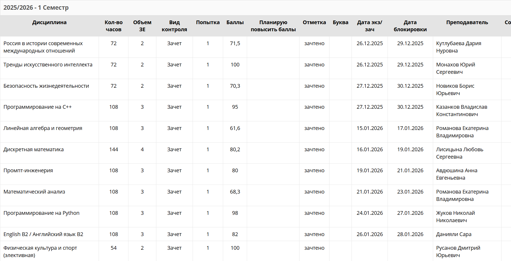
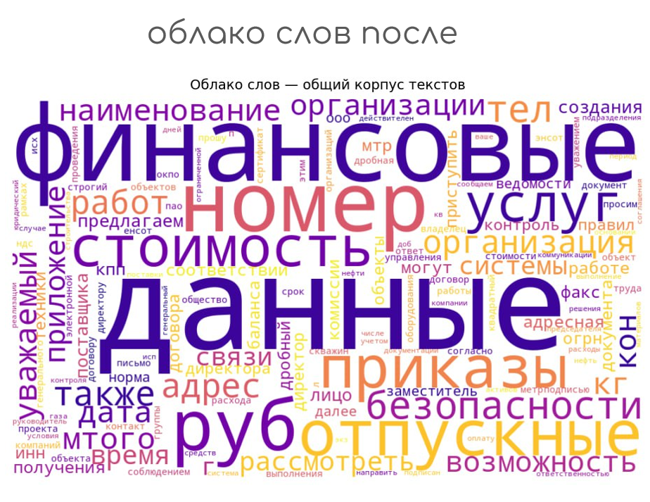
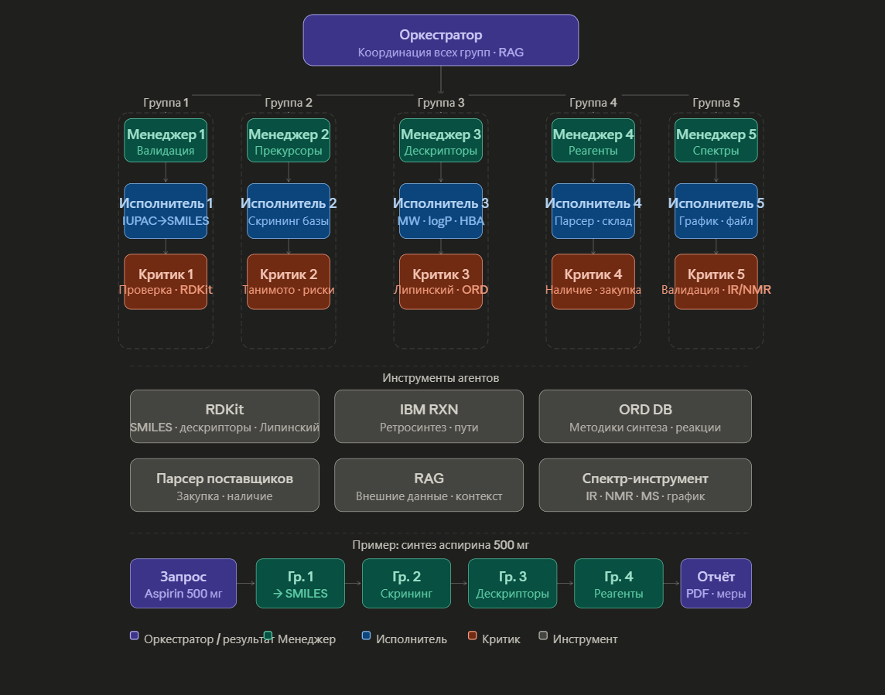
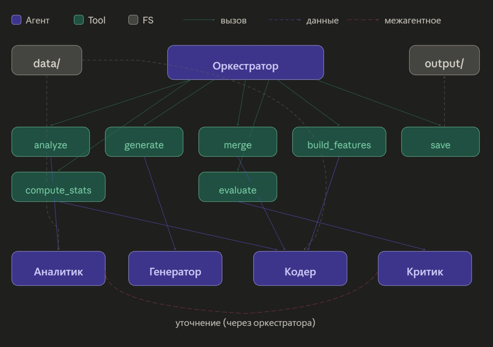
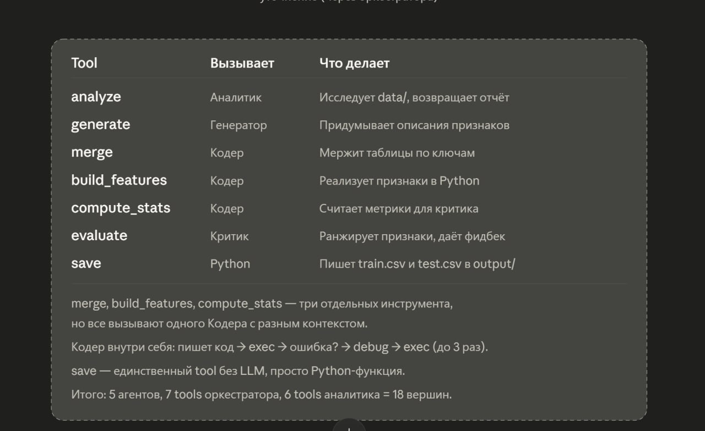
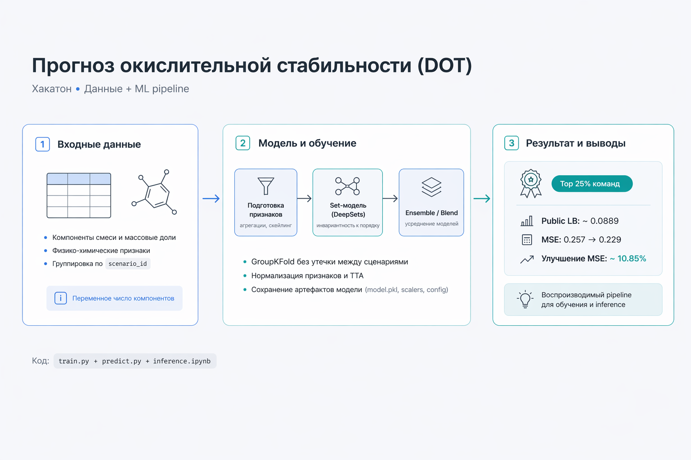
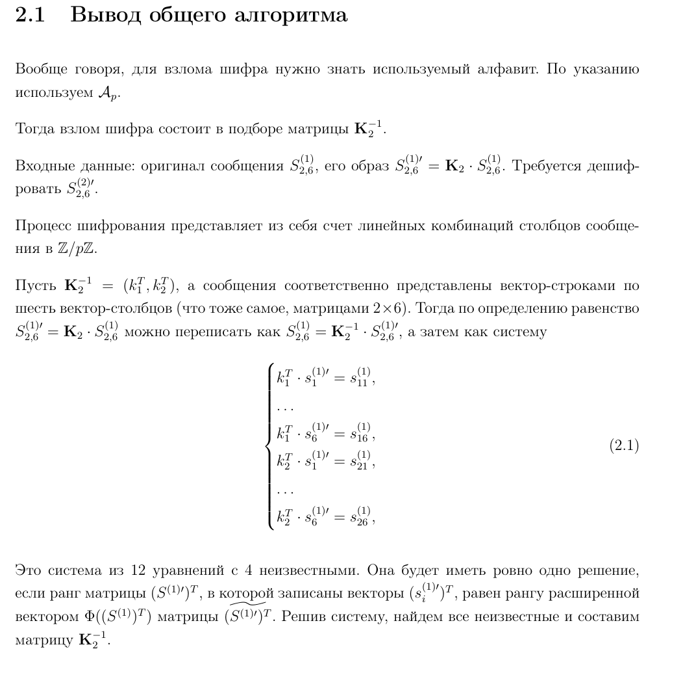
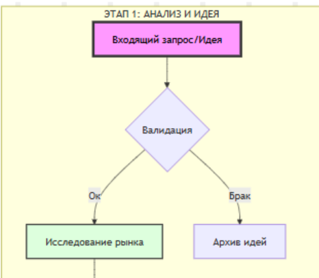
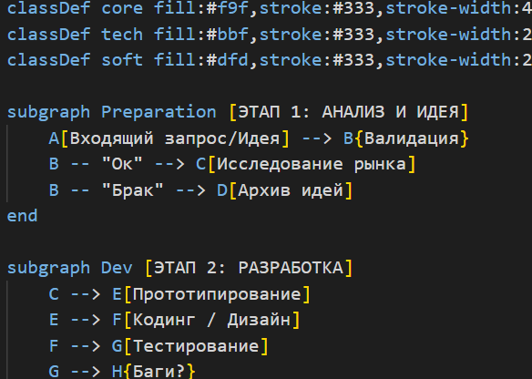

# Учебные достижения

## Успеваемость
- **Отличник**. По итогам семестра получил автоматические зачеты по всем дисциплинам, включая курс «Тренды ИИ» от Александра Бухановского (вошел в топ 10 из 150+ студентов). Потверждение в ИСУ: 

- **Стипендиат ГПН** «Спецтрека ДС» программ «Нейротехнологии и Программирование» и «Инженерии Искуственного Интеллекта» (**единственный прошел со своего направления**). Потверждение: . [потверждающий документ]().

## Хакатоны
- **Хакатон от ГПН** – оценка за проект 5.0. Обучение BERT для классификации корпоративных писем. [GitHub](https://github.com/AR-git-hub/GPN_Hackaton_ARTeam)

- **Хакатон «ИТМО х СБЕР х ПРОСТО»** - финалист. Мультиагентная система с богатым пулом тулов для ассистирования работы химика-органика в научной лаборатории. 

[Sourcecraft](https://sourcecraft.dev/chem-mas-assistant/langgraphmas),
[Сертификат]("pdf/сертификат_Александру_Рябкову.pdf").

- **Хакатон «СБЕР Риски»** – мультиагентная система feature-engineering для CatBoost. [GitHub](https://github.com/AR-git-hub/AI-agent-for-Feature-Engineering).

- **Хакатон «Нефтекод» от Газпромнефти** – DeepSets-подобная set-модель для предсказания 2 регрессионных целей DOT (химический анализ). [GitHub](https://github.com/AR-git-hub/Chemistry-Daimler-Oxidation-Prediction).

## Учебные проекты
### **Веб-приложение для финансового учета с CRM**  
  Руководитель: Жуков Николай Николаевич

  Стек: Flask, HTML/CSS/JS, Jinja2.  
  
  [GitHub](https://github.com/KirillPetukhov1/python_1sem_hakaton?tab=readme-ov-file) 

### **Работа по криптографии** 
Шифры Хилла и кода Хэмминга. Оформление в LaTeX.  

  [PDF отчет](pdf/Math.pdf)
  

### **Мегашкола ИТМО. Система генерации Mermaid-кода из диаграмм BPMN/UML**  
  Преобразование изображений бизнес-процессов в код Mermaid и текстовое описание.  

  Руководители: Кугаевских Александр Владимирович, Авдюшина Анна Евгеньевна.

  Стек: Qwen3-VL-2B-Instruct с квантованием, дообучение QLoRA. Сайт: FastAPI, Streamlit. Проект: Docker.  

  *BPMN-диаграмма:* 

  
  
  *Код:* 

  

### **Репозиторий с лабораторными работами по Python**
Решения учебных задач и проектов. Например, учебно-исследовательские работы с scikit-learn (второй семестр, LR5 и LR6) или сайт для подписки на курсы валют API ЦБ РФ (первый семестр, ЛР7-ЛР9).
[GitHub](https://github.com/AR-git-hub/ITMO.py)